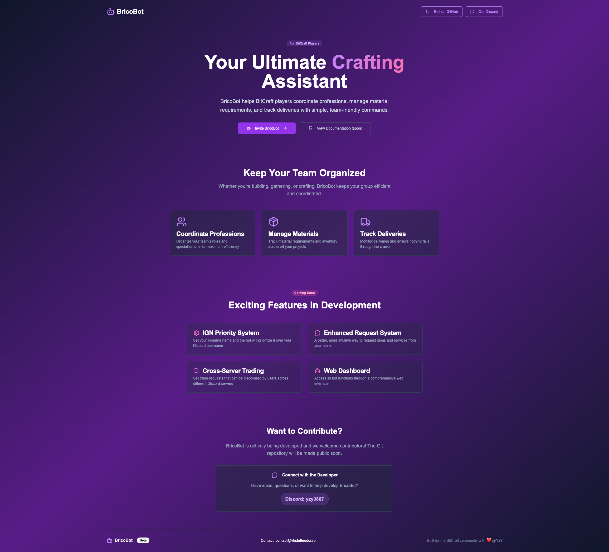

# Brico Landing Page

A modern landing page built with Next.js and TypeScript.

## Description

Brico Landing Page is a modern web application built with Next.js and TypeScript, providing an elegant and responsive user experience.

## Technologies Used

- **Next.js 15.2.4** - React framework for web applications
- **TypeScript** - Statically typed programming language
- **React** - JavaScript library for user interfaces
- **Tailwind CSS** - Utility-first CSS framework for rapid styling
- **Radix UI** - Accessible and high-quality UI components
- **Lucide React** - Modern and elegant icons

## Features

- 🎨 Modern and responsive design
- 🌙 Dark/light theme support
- 📱 Mobile optimized
- ⚡ Optimized performance
- 🔧 Reusable UI components
- 🎯 Enhanced accessibility